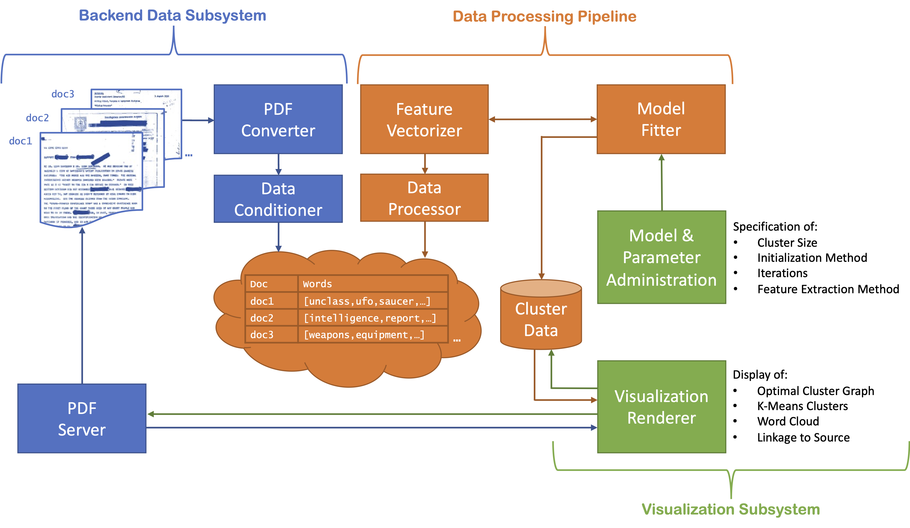

---
title: "Checkpoint 1 - Team UFO"
author: "Cory Maclauchlin, John Myers, Arivirku Thirugnanam"
date: "6/3/2022"
output:
  pdf_document:
    latex_engine: xelatex
  html_document:
    df_print: paged
subtitle: An Analysis of Declassified Government Documents
---

\vspace{-15truemm}

# Introduction
There has been a recent uptick in the conversations surrounding the notion of "Unidentified Flying Objects," or UFOs, in the media due to Congressional inquiries on the topic.  Freedom of Information Act (FOIA) request.

# Problem Description

Some of the technical challenges of this project include:

* **Large Troves of Documents.**  When released, a trove of documents is published all at once.  These can include hundreds of PDFs with thousands of pages.  For this particular release, there are ### documents composed of ### pages.
* **Data That is Dirty.** Documents that are released by the Government are scans of printed materials, with redactions made.  This is the ensure that nothing is accidentally revealed that isn't supposed to be, so a physical step is required in Government release procedures.  As such, any useful digital representation is obliterated.
* **Unusual Lexicon.** A standard dictionary methodology may not be appropriate for certain documents types, especially this dataset.  The unusual lexicon will require an unsupervised approach to performing processing.
* **One more thing.** This will be one more thing.

# Software Development

Our development methodology will leverage on the tools of the trade for.  We have performed an initial survey of the requirements of the sytem, along with a design and implementation approach, which will now be discussed in more detail.

## Requirements

This tool will designed generically to accommodate any type of cache of FOIA-released documents from the government in PDF form.

There will be two primary user classes for the developed software.  The first user class is the data engineer who will set up the backend for data processing, including administering parameters for the model generation steps.  The second user class is a person interested in understanding the document set, especially for finding the hidden patterns within the data.  In addition, this user class will leverage the clusters that have been exposed 

## Design

The overall architecture will be designed around three subsystems and pipelines, the Backend Data Subsystem (in Blue), the Data Processing Pipeline (in Orange), and the Visualization Subsystem (in Green):

### Backend Data Subsystem
The backed data subsystem will be responsible for opening all of the OCR'd PDF files within the specified directory, cleaning them as appropriate, and building the interim data format for the data processing pipeline. 

1. Documents will be parsed and imported
1. All words will be compared to a english dictionary and only actual words will be indexed
1. Only documents that ultimately have more than 2 words will be indexed

Finally, as a stretch goal, we will have an accessor available so that a user can choose a specific document from a cluster displayed on the rendered visualizations and see the contents of the original (source) document that was used.

### Data Processing Pipeline

1. K-Means Flat Clustering

### Visualization Subsystem

We will create user interfaces that will allow for both the administering of the data processing pipeline parameters and also the visualization of the results of the analysis.  

Several of the parameters that will modifiable in the User Interface will be:
 * Cluster Size
 * Initialization Method
 * Iterations
 * Feature Extraction Method

Once parameters have been changed and processing is complete, the following displays will be displayed to the user as a result:
 * Optimal Cluster Graph
 * K-Means Clusters
 * Word Cloud
 * Linkage to Source

## Implementation

* Apache PDFBox

# Test & Demonstration

* We will use the ### PDFs that have been published here: https://documents2.theblackvault.com/documents/cia/CIAUFOCD-FULL-CONVERTED.zip.  These documents have been made searchable from the original release by the CIA under a FOIA request.

# Appendix

