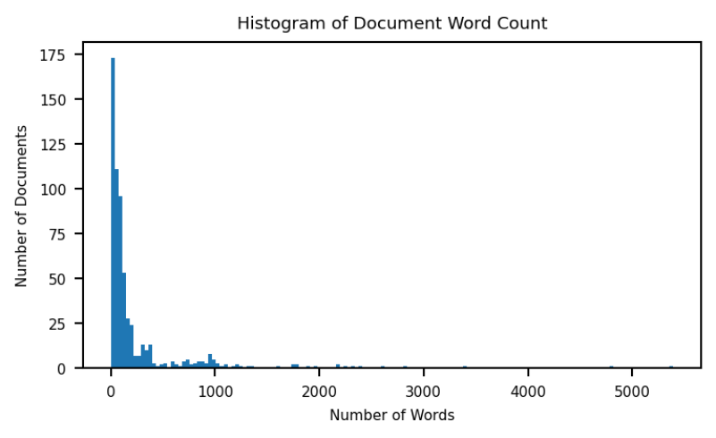
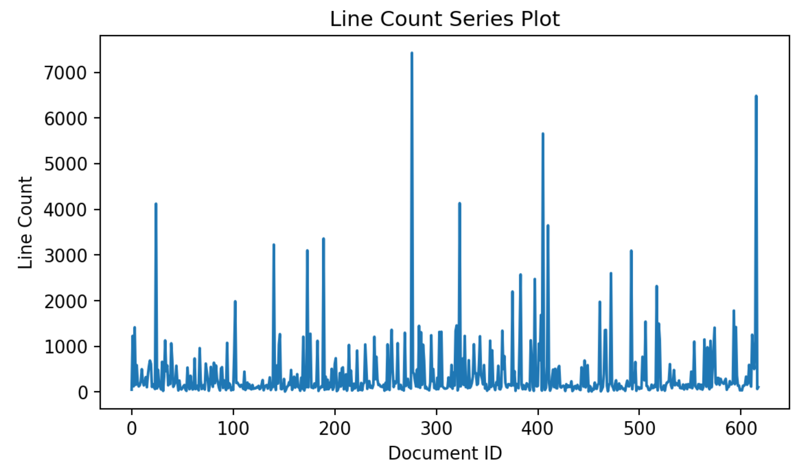
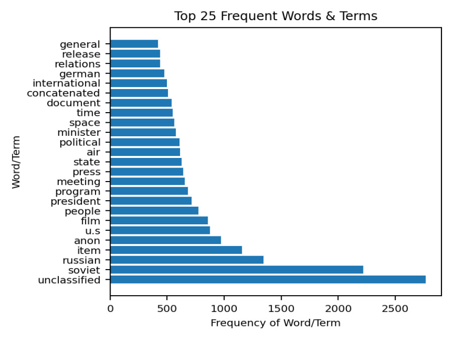
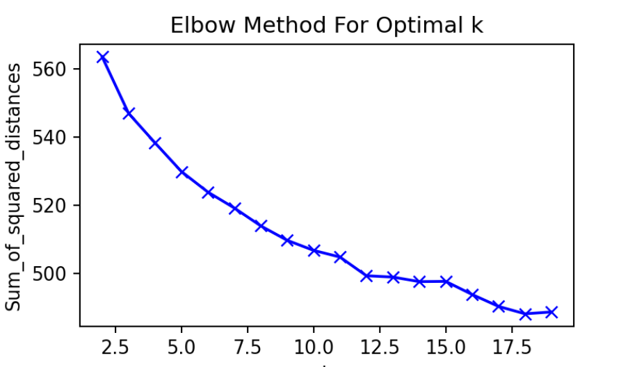
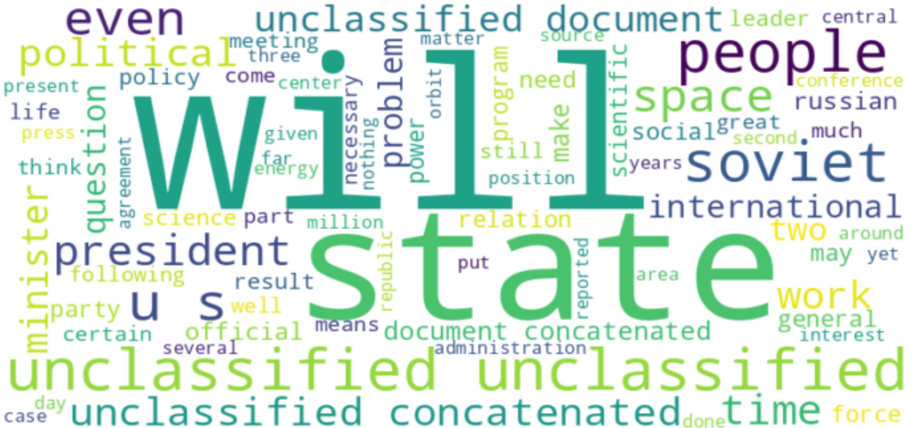
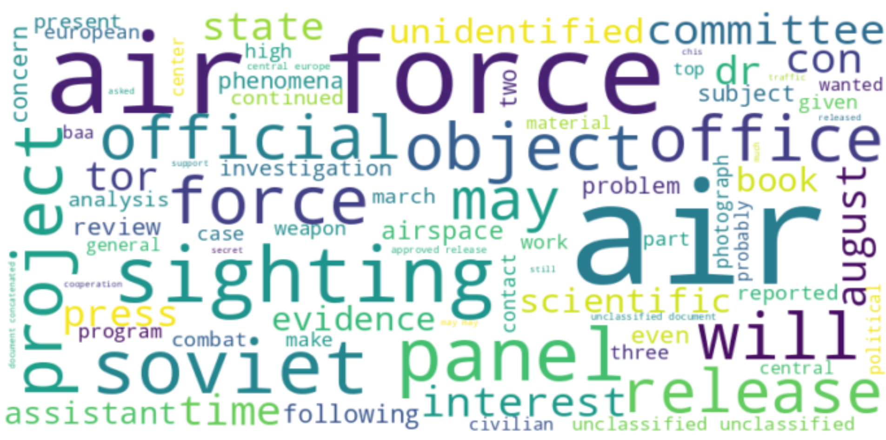
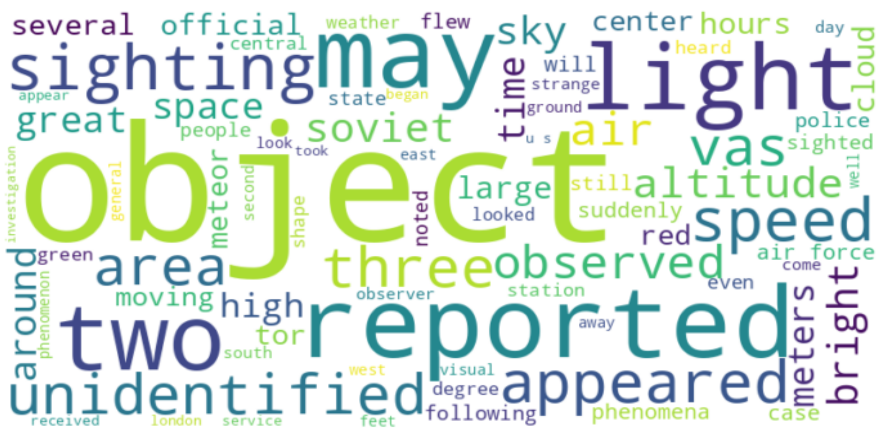
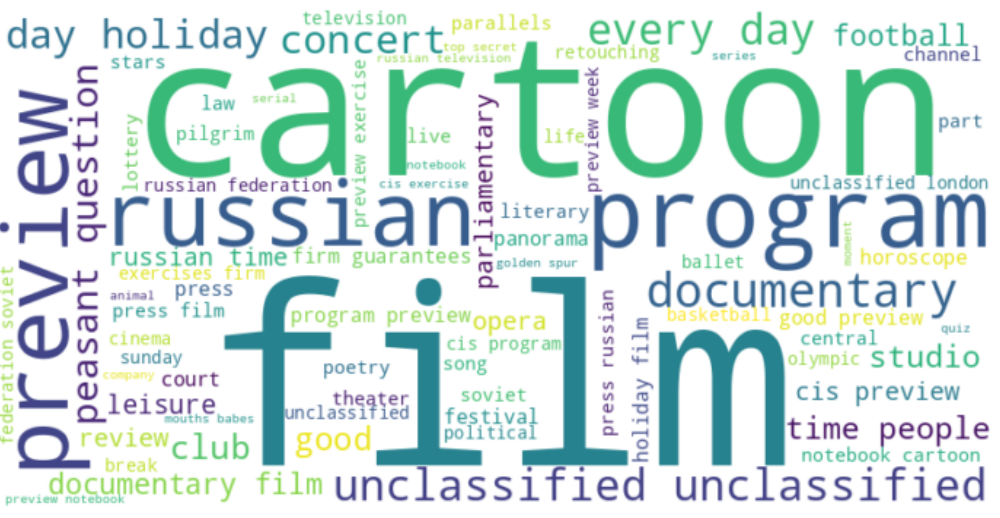

# Introduction

The United States Government Freedom of Information Act (FOIA) allows individual citizens the right to ask for and receive previously unreleased documents possessed by the Government upon request. Our project endeavors to see if there are any hidden patterns surrounding the origin of the so-called Unidentified Flying Objects (UFOs) that the Government hasn't disclosed before. We will apply our developed system to a series of PDF documents released by the Central Intelligence Agency (CIA) through a FOIA request to understand the text content better.

# Source Data Collection

Our goal is to use 713 Government-released documents that have been made available through the website "The Black Vault." This site provides two sets of digital artifacts. The first is a zip of PDFs that have been made searchable from the original release by the authors of the website. The original source for these documents is also available in TIFF image form. An explanation of the artifacts and processing of each is further explained.

# Data Conditioning and Processing

The backend data subsystem will be responsible for opening all PDF files within the specified directory, cleaning them as appropriate, and building the interim data products for the data processing pipeline.

 1.  Documents are opened, tokenized, and imported into memory.
 1.  All tokenized words will be compared to a Wordnet, and only words with semantics will be indexed.
 1.  Only documents that ultimately have more than two actual words will be indexed.

The team initially discovered upon using the processed PDFs made available by the above website that they inserted advertisements into the PDFs[^1]. These ads were causing false keywords to be inserted into the document and causing our statistics not to be valid. As a result, we returned to the source original TIFF images released by the CIA and reran Optical Character Recognition (OCR) on those documents[^2]. This OCR was run in batch mode through Adobe Acrobat Pro and was quite time-consuming; however, because of this work, all of our initial observations are much more accurate to the reality of parsing through Government released documents. These OCR-processed documents are available upon request.[^3]

Using the criteria listed, we are forced to eliminate 95 documents with no valuable content.

\newpage

# Initial Observations

After parsing through the data using the documents produced and filtered as detailed above, we were able to establish a dictionary of 8,205 unique words within all the documents available. As seen in Figure \ref{WordCountHist}, we first looked at the overall distribution of word counts within the 618 documents that had useful content. There is a large concentration on the lower end, so there isn't a normal distribution. In addition, there are some extreme outliers on the upper end. The team doesn't feel that this distribution will negatively affect the research to be conducted in this case, as we did a fair amount of prepping of the dataset to get to this point.

After observing this distribution, we continued by computing the overall page word count summary statistics. The summary is seen in Table \ref{SummStatsWord} and shows that, on average over the 618 documents, we see \~238 words per document. While this mean is skewed by the single outlier document of 5392 words, a look at the offending document, `C05517512.pdf`, shows a relatively cleanly scanned document of the same relative type as the rest. Because of this, we don't feel even the median of 82 words causes this dataset to be invalid for our research.

| count | mean   | std    | min | 25%   | 50% | 75%    | max  |
|-------|--------|--------|-----|-------|-----|--------|------|
| 618   | 238.34 | 492.13 | 3   | 31.25 | 82  | 184.50 | 5392 |
: Summary Statistics of Word Count\label{SummStatsWord}

\newpage

In addition, a line count was computed for each of the filtered documents (documents with at least three words). A series plot by Document ID/Name for the line count across the documents is shown in Figure \ref{lineCount}.

The summary statistics for line count is also calculated to look at the distribution of the lines across the documents. The details are provided in Table \ref{SummStatsLine}. In many cases, the line count is greater than the word count because of the fact that there are several invalid lines in the document which were redacted. For example, the maximum number of lines found is in `C05516145.pdf` where most lines are unreadable. 

| count | mean   | std    | min | 25%   | 50%   | 75%    | max  |
|-------|--------|--------|-----|-------|-------|--------|------|
| 618   | 370.28 | 681.18 | 10  |  87   | 149.5 | 336.5  | 7427 |
: Summary Statistics of Line Count\label{SummStatsLine}

Because documents have potentially degraded information due to both scanning quality and redactions inherent within FOIA-released documents, this measure helps ascertain the viability of text information within. We assess that between these two measures, this remains a reasonable dataset to continue our development on.

After the analysis of the word and line counts per document, we next wanted to look at some simple statistics related to frequent words seen within all of the documents. We can see in Figure \ref{FrequentWordsBar} that some not surprising words emerge at the top of this list. We see that `unclassified` appears the most number of times within the documents, at 2768 times, followed by `soviet` and `russian` at 2218 and 1345, respectively. This gives us reasonable assurance that our techniques and processes are in order, as these are obviously critical keywords to the domain we are in.

Now that we know we have a reasonable data processing pipeline for the backend, we can now begin to look at refining our software development approach and converge on what information retrieval and text mining operations can be applied for our entire application.

# Initial Cluster Exploration

We began looking at a high level of what clusters exist within the data when tokenizing actual English words within the documents.  Figure \ref{ElbowMethodOptimalK} shows the Sum of Square Distances for k-clusters where `k` is between 2 and 20.  If we choose a cluster size of 10 based upon the observations, Table \ref{Clusters} shows Word Clouds for four of those clusters. Further research will be conducted in this area in subsequent milestones to understand better what those clusters might indicate, as well as determine the similarity between documents within those clusters.

| | |
|--|--|
|||
|||
: Sample Word Clouds for Four Clusters\label{Clusters}

[^2]: Raw TIFF images from Government: <https://documents2.theblackvault.com/documents/cia/CIAUFOCD-FULL-UNTOUCHED.zip>
[^1]: Processed "Searchable" PDFs with Advertisement: <https://documents2.theblackvault.com/documents/cia/CIAUFOCD-FULL-CONVERTED.zip>
[^3]: Team GitHub with Data: <https://github.com/johnemyers/iste-612/tree/main/data/CIA-MY-OCR>
